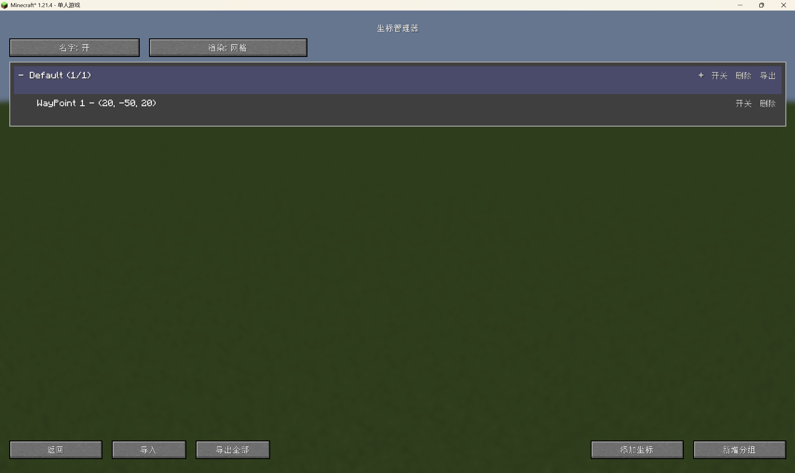
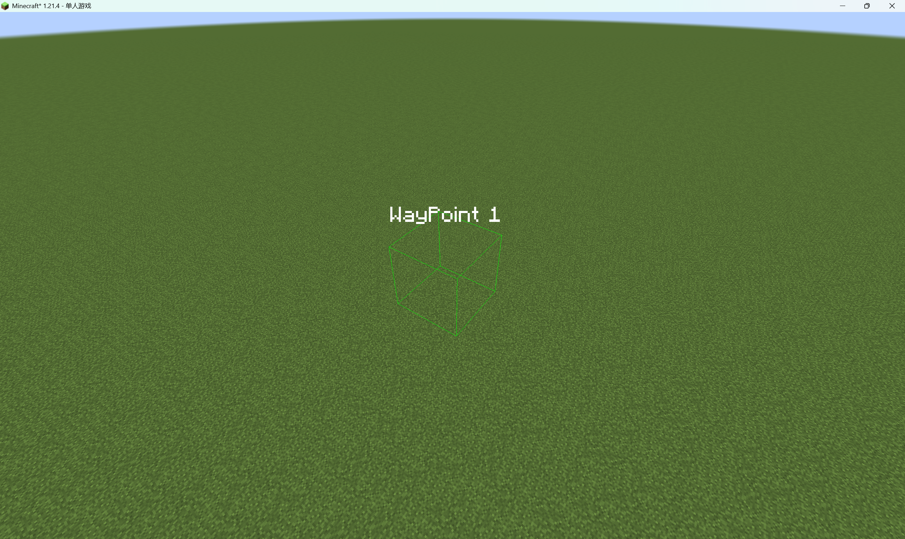
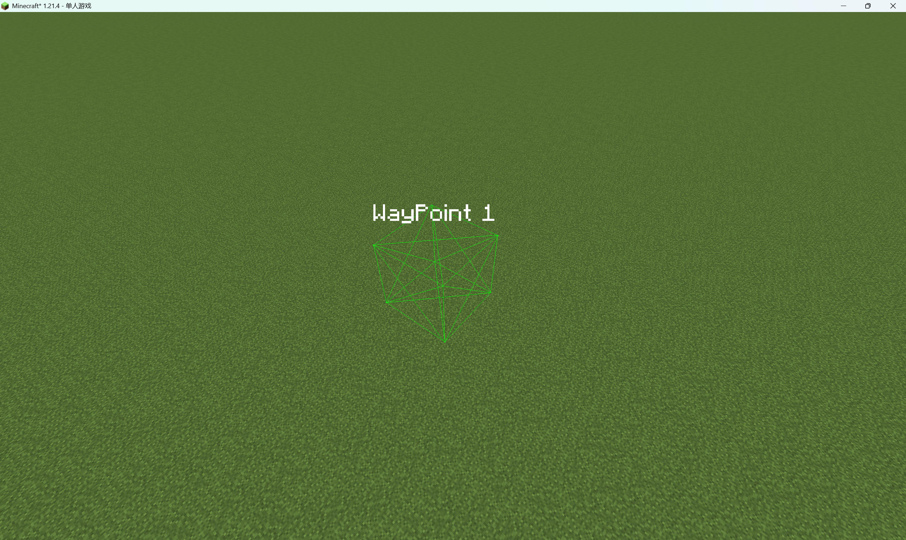
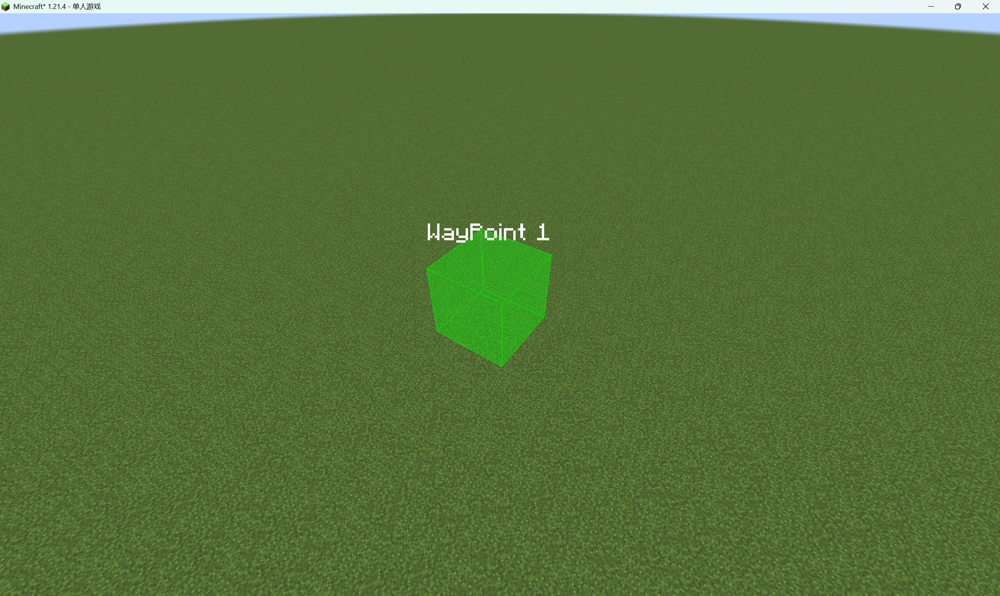

# EmoHelper

> A Fabric coordinate helper mod for Minecraft 1.21.4.
> 
> 一个用于 Minecraft 1.21.4 的 Fabric 坐标辅助模组。

## TL;DR

- In-game coordinate manager UI
- Grouping, import/export (JSON)
- 3 marker render modes
- Independent label toggle
- Hotkeys: `B` (open UI), `V` (toggle rendering)

- 游戏内坐标管理界面
- 分组与 JSON 导入导出
- 3 种坐标渲染模式
- 名字显示独立开关
- 快捷键：`B`（打开界面）、`V`（渲染总开关）

---

## Features / 功能

### EN
- Add / edit / delete coordinate points in UI
- Group operations: add, rename, delete, reorder, enable/disable
- JSON import/export for coordinate sharing
- Marker render modes:
  - `OUTLINE` - wireframe
  - `MESH` - wireframe + face mesh
  - `FULL_BLOCK` - solid faces + outline
- Label visibility toggle independent from marker rendering

### 中文
- 在界面中增删改坐标点
- 分组管理：新增、重命名、删除、排序、整组开关
- JSON 导入导出，方便共享坐标
- 渲染模式：
  - `OUTLINE` - 线框
  - `MESH` - 线框 + 面网格
  - `FULL_BLOCK` - 实心面 + 外轮廓
- 名字显示开关与方框渲染开关独立

---

## Screenshots / 截图
-  Main Screen / 主屏幕

- Outline Mode / 线框模式

- Mesh Mode / 网格模式

- Full Block Mode / 实心块模式

---

## Compatibility / 兼容信息

Based on current project config:

- Minecraft: `1.21.4`
- Fabric Loader: `0.18.4`
- Fabric API: `0.119.4+1.21.4`
- Java: `21`

---

## Installation / 安装

### EN
1. Install Fabric Loader for Minecraft `1.21.4`
2. Install Fabric API
3. Put the built mod `.jar` into your `.minecraft/mods` folder
4. Launch the game with Fabric profile

### 中文
1. 先安装 Minecraft `1.21.4` 对应的 Fabric Loader
2. 安装 Fabric API
3. 将构建出的模组 `.jar` 放到 `.minecraft/mods` 目录
4. 使用 Fabric 配置启动游戏

---

## Usage / 使用说明

### Hotkeys / 快捷键
- `B`: Open coordinate manager / 打开坐标管理界面
- `V`: Toggle marker rendering / 切换渲染总开关

### Basic flow 
1. Press `B` to open manager
2. Add points and organize groups
3. Choose render mode in UI
4. Toggle labels as needed
### 常用流程
1. 按 `B` 打开管理界面
2. 添加坐标并整理分组
3. 在 UI 中切换渲染模式
4. 按需开关名字显示

---

## Configuration / 配置

Runtime config file:

- `run/config/emohelper/emohelper.json`

Important fields:

- `renderingEnabled`: global marker rendering on/off
- `showLabels`: label on/off
- `renderMode`: `OUTLINE | MESH | FULL_BLOCK`
- `renderDistance`: max marker rendering distance

- `renderingEnabled`：渲染总开关
- `showLabels`：名字显示开关
- `renderMode`：渲染模式
- `renderDistance`：渲染距离

---

## Changelog / 更新记录

### v0.0.1-Beta
- Initial public beta
- Coordinate manager + rendering modes + label control

---

## License / 许可证

GNU Affero General Public License v3.0 (`AGPL-3.0`). See `LICENSE.txt`.