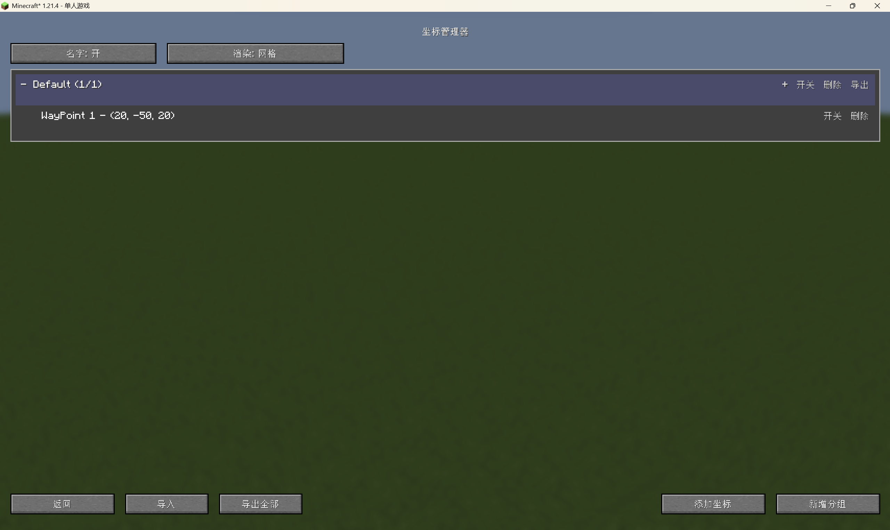
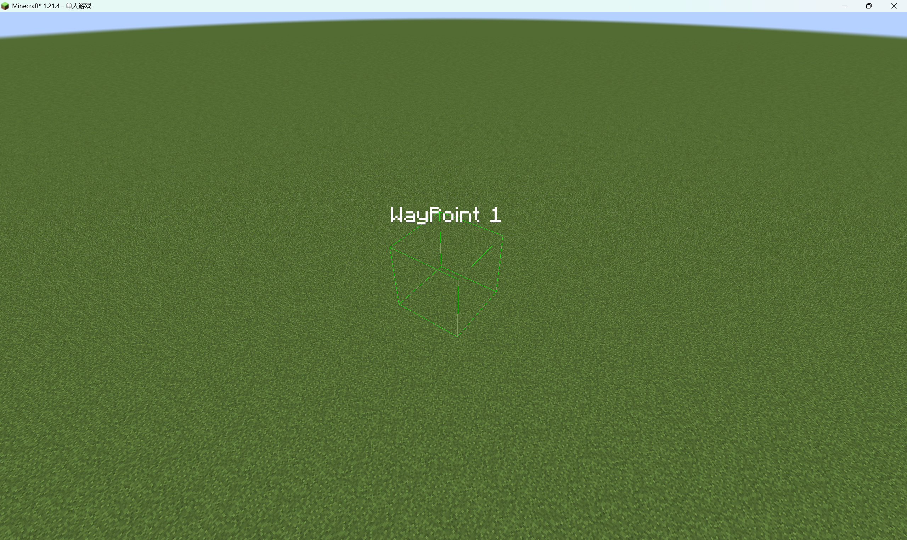
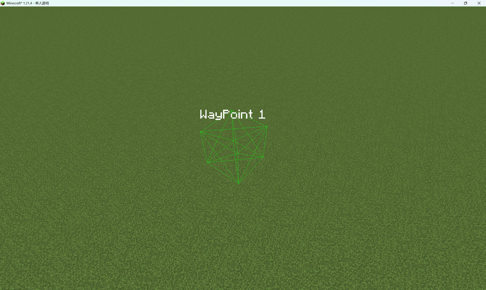
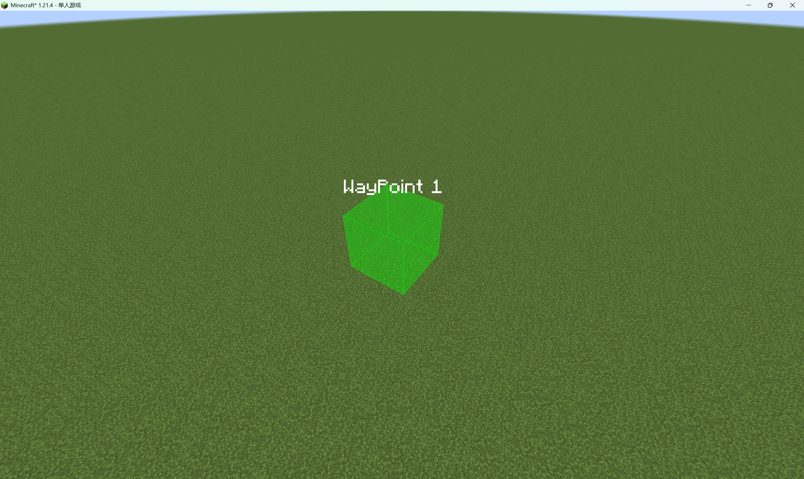

# EmoHelper

  

> A Fabric client-side coordinate helper mod for Minecraft 1.21.4.  
> 一个用于 Minecraft 1.21.4 的 Fabric 客户端坐标辅助模组。

## TL;DR

- In-game point manager with groups, import/export, and rendering options
- Ordered groups support ALL / PROGRESSIVE display, route loop, guide line, and route links
- Quick-create waypoint at player position (`J`) with localized auto temp name (`Temp1` `Temp2` ...)
- Per-group independent limit: **200 points per group**
- Group lock support: locked groups block add/delete/edit/reorder/move operations

- 游戏内坐标管理、分组、导入导出、渲染设置
- 有序组支持 全部/逐步 显示、闭环、准星引导线、点位连线
- 快速建点（`J`）：使用玩家当前位置，自动临时命名（`临时1`、`临时2`...）
- 每组独立上限：**每组 200 点**
- 分组锁定：锁定后禁止该组增删改、拖拽排序与跨组移动

---

## Compatibility / 兼容信息

- Minecraft: `1.21.4`
- Fabric Loader: `0.18.4`
- Fabric API: `0.119.4+1.21.4`
- Java: `21`

---

## Features / 功能

### Coordinates and groups

- Add / edit / delete points in UI
- Group operations: add, rename, delete, reorder, enable/disable
- Group lock / unlock in list view
- JSON import/export (all groups or single group)

### 坐标与分组

- 在游戏内 UI 中增删改坐标点
- 分组操作：新增、重命名、删除、排序、整组启用/禁用
- 列表中支持分组锁定/解锁
- JSON 导入导出（全部分组或单个分组）

### Rendering

- Point render modes:
  - `OUTLINE`
  - `MESH`
  - `FULL_BLOCK`
- Label rendering toggle per group
- Ordered group route display:
  - `ALL`: show all ordered points
  - `PROGRESSIVE`: show current + next point
- Ordered route links:
  - Connect ordered points in sequence
  - Optional loop (tail to head)
  - In progressive mode, draw link between the two visible points
  - Segment hidden when both endpoints are outside render distance

### 渲染

- 坐标点渲染模式：
  - `OUTLINE`
  - `MESH`
  - `FULL_BLOCK`
- 每个分组可独立开关标签显示
- 有序组显示模式：
  - `ALL`：显示全部有序点
  - `PROGRESSIVE`：仅显示当前点和下一个点
- 有序组路径连线：
  - 按顺序连接每个点
  - 可选闭环（尾连头）
  - 逐步模式下显示两个可见点之间的连线
  - 当线段两端都超出渲染距离时不渲染该线段

### Ordered route extras

- Crosshair guide line to next target
- Route start index
- Loop route option

### 有序路线附加功能

- 准星引导线指向下一个目标点
- 路线起始点序号设置
- 路线闭环开关

### 快捷功能

- 快速创建坐标点（默认 `J`）
- 自动分配临时名称（`临时N`，跳过已占用编号）
- 添加坐标界面中 `X/Y/Z` 默认显示为玩家当前位置占位文本，可直接输入覆盖

---

## Hotkeys / 快捷键

- `B`: Open coordinate manager / 打开坐标管理界面
- `V`: Toggle global rendering / 切换渲染总开关
- `N`: Toggle ordered display mode / 切换有序组显示模式
- `M`: Initialize ordered route / 初始化有序路线
- `J`: Quick create point at player position / 快速创建当前位置坐标点

> Keybinds are configurable in Minecraft Controls menu.  
> 可在 Minecraft 控制设置中改键。

---

## Installation / 安装

### EN

1. Install Fabric Loader for Minecraft `1.21.4`
2. Install Fabric API
3. Put mod `.jar` into `.minecraft/mods`
4. Launch with Fabric profile

### 中文

1. 安装 Minecraft `1.21.4` 对应 Fabric Loader
2. 安装 Fabric API
3. 将模组 `.jar` 放入 `.minecraft/mods`
4. 使用 Fabric 配置启动

---

## Configuration / 配置

### Runtime files

- Global config: `run/config/emohelper/emohelper.json`
- Group data files: `run/emohelper/*.json`

### 运行时文件

- 全局配置：`run/config/emohelper/emohelper.json`
- 分组数据：`run/emohelper/*.json`

### Notes

- Global file stores mod-level options (e.g. global rendering state)
- Each group file stores:
  - group metadata (`groupType`, render settings, lock state)
  - points list
  - order index

### 说明

- 全局文件保存模组级配置（例如渲染总开关）
- 每个分组文件保存：
  - 分组元数据（`groupType`、渲染设置、锁定状态）
  - 坐标点列表
  - 分组排序索引

### 常见字段

- `renderingEnabled`: global render switch / 渲染总开关
- `renderMode`: `OUTLINE | MESH | FULL_BLOCK`
- `locked`: group lock state / 分组锁定状态
- `routeLineEnabled`, `routeLineGradient`, `routeLineAlpha`, `routeLineBrightness`: ordered route link styling

---

## Screenshots / 截图

- Main Screen / 主屏幕  
  
- Outline Mode / 线框模式  
  
- Mesh Mode / 网格模式  
  
- Full Block Mode / 实心块模式  
  

---

## License / 许可证

GNU Affero General Public License v3.0 (`AGPL-3.0`). See `LICENSE.txt`.